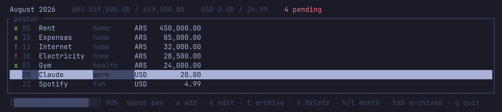
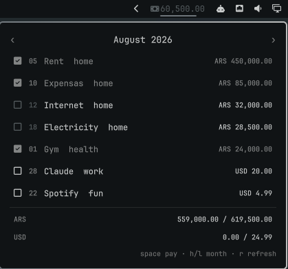

# paybar

What falls due this month, and what is left to pay. Two surfaces over one
SQLite file: a terminal UI, and a widget in the [Omarchy](https://omarchy.org)
bar.



Not a budgeting app. It tracks the charges whose amount and due day you already
know — rent, the gym, three subscriptions — and refuses the rest: no variable
spending, no income, no bank import, no budgets.

## Install

```sh
cd core && cargo build --release && cp target/release/paybar ~/.local/bin/
cd ../shell && ./install.sh          # Omarchy bar widget, optional
```

Everything lives in one SQLite file at `~/.local/share/paybar/expenses.db`
(override with `PAYBAR_DB`). It is yours to open: `sqlite3 ~/.local/share/paybar/expenses.db`.

## Use

```sh
paybar add Rent 450000 --day 5 --category home
paybar add Claude 20 --day 28 --currency usd --category work
paybar                               # the TUI above; space marks a row paid
```

That is the whole daily loop. The rest of the CLI is there for scripts and for
the months you are not looking at:

```
paybar ls [--period YYYY-MM] [--pending|--paid|--all] [--archived]
paybar pay <id> [--period YYYY-MM] [--amount <a>]
paybar unpay <id> [--period YYYY-MM]
paybar edit <id> [--name|--amount|--day|--category|--currency|--archive|--restore]
paybar rm <id>
paybar status [--period YYYY-MM] [--json]
```

```sh
$ paybar status
ARS 559,000.00 / 619,500.00 · 2 pending, 2 overdue
USD 0.00 / 24.99 · 2 pending, 0 overdue
```

### Four rules worth knowing

**A month is the unit.** Paid, overdue and due are not stored, they are worked
out from the period you are looking at. The same expense reads overdue in July
and due in August with nothing to migrate, and paying August never touches
July.

**A due day past the end of a month is clamped, never rolled forward.**
`--day 31` falls on the 28th in February, so the charge stays in the month it
belongs to.

**Money is integer cents.** `.` is the decimal separator, `,` and `_` are
ignored as digit grouping, and more than two decimals is an error rather than a
silent rounding.

**Currencies are grouped, never summed.** ARS and USD are reported side by
side and left that way. A rate may *annotate* a total — never merge two:

```
ARS 585,196.00 / 585,196.00 · 0 pending, 0 overdue
USD   1,140.00 /   1,140.00 · 0 pending, 0 overdue
    ≈ ARS 1,767,000.00 @ blue 1,550.00
```

The `≈` line is derived, approximate and dated, and says so: it always carries
the casa and the rate, and admits its age once stale. The two lines above it
stay exact. Nothing converted is ever written to the database.

The rate comes from [dolarapi](https://dolarapi.com) — public and keyless —
and refreshes lazily, when a surface asks for a month that holds both
currencies and the cached rate has expired. Opening the TUI or the bar popup
is what updates it; an all-ARS month never touches the network, and a failed
fetch falls back to the last known rate rather than failing the command.

| | | |
|---|---|---|
| `PAYBAR_FX` | `on` | `off` removes the annotation entirely |
| `PAYBAR_FX_CASA` | `blue` | `oficial`, `blue`, `bolsa`, `contadoconliqui`, `cripto`, `mayorista`, `tarjeta` |
| `PAYBAR_FX_TTL` | `3600` | seconds a fetched rate stays fresh |

Which casa is a real choice, not a default worth ignoring: on 2026-08-23 they
spanned 1520 to 1976. Card subscriptions clear near `tarjeta`; dollars you buy
yourself, nearer `bolsa` or `cripto`. See
[`docs/adr/002-fx-is-an-annotation.md`](docs/adr/002-fx-is-an-annotation.md).

### TUI keys

`space`/`p` pay · `a` add · `e` edit · `t` archive · `x` delete · `h`/`l` month · `Tab` archived · `j`/`k` move · `r` refresh the rate · `q` quit

Add and edit take one line — `<name> <amount> <day> [category]` — parsed from
the end, so a name may contain spaces without quoting.

## Bar widget

<p align="center">
  
</p>

The bar shows what is still outstanding this month, or a check mark when
nothing is. The popup settles a row with `space` and steps through months with
`h`/`l`, the same keys as the TUI.

It never opens the database: it shells out to `paybar --json`, so clamping,
cents and currency grouping are decided in exactly one place. See
[`docs/adr/001-qml-surfaces-call-the-cli.md`](docs/adr/001-qml-surfaces-call-the-cli.md).

## Theming

Neither surface hardcodes a color. The TUI uses only ANSI indexed colors, so
the terminal palette is the palette; the widget uses the bar's own tokens.
`omarchy theme set <name>` re-themes both with no code change — the two
screenshots above are the same program under Tokyo Night and Solitude.

## Layout

| | |
|---|---|
| `core/` | Rust binary: CLI verbs and the Ratatui TUI |
| `shell/` | Omarchy bar widget (Quickshell QML) |
| `CONTEXT.md` | the domain model |
| `CONTRACT.md` | the schema and command surface both surfaces conform to |
| `docs/` | specs, plans, decision records |

Sibling to [`tobar`](https://github.com/matiaslapolla/tobar), which does the
same thing for todos.
